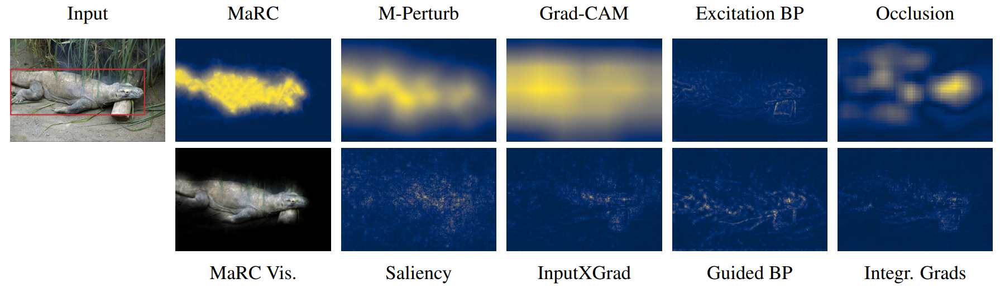
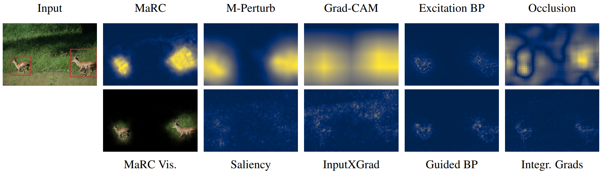
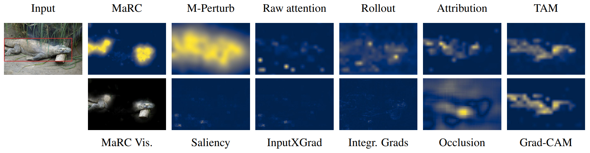
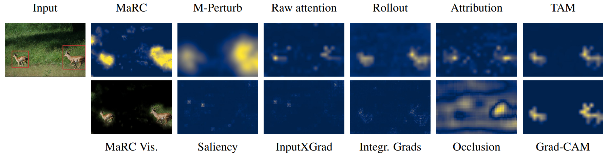

This is the official code repository for the paper [Model Interpretability and Rationale Extraction by Input Mask Optimization](https://aclanthology.org/2023.findings-acl.867/)
published at ACL 2023. The repository contains the code for two experiments regarding interpreting
neural network decisions, one on textual data in the form of movie reviews and one on imagenet images.

The MaRC approach allows for creating faithful and human-like rationales in a model agnostic way, only requiring access
to the model's gradient.

# Movie Reviews

### Adding the Dataset

This repo does not include the movie reviews dataset that was used in this experiment. To run the experiments,
please go to https://www.eraserbenchmark.com/ and download the movie reviews dataset. Afterwards, extract the data
into `movie_reviews/data`. The result should look as follows:
```
movie_reviews/
└── data/
    ├── docs/
    │   ├── negR_000.txt
    │   ├── negR_001.txt
    │   └── ...
    ├── test.jsonl
    ├── train.jsonl
    └── val.jsonl
```

### Recreating the Original Experiment

The code for running to movie reviews experiment is located in the `movie_reviews` folder.

To use the same classifier weights that was used in the original experiment, or to view/evaluate the predicted masks from the
original experiment, please download the files `clf_MaRC_paper.pkl` and `movie_reviews_predictions.zip` from
[https://zenodo.org/records/10470789](https://zenodo.org/records/10470789). Then, place `clf_MaRC_paper.pkl` in the folder
`movie_reviews/saved_models`, and place the folder `MaRC_paper` from `movie_reviews_predictions.zip` in the folder
`movie_reviews/predictions`.

Running the file `run_movie_reviews.py` will recreate the experiments from the paper using the provided code.
The default setup will evaluate the existing masks from the original experiments.
To create own masks using the same model weights, you can rename the folder `movie_reviews/predictions/MaRC_paper` to
any other name (or not place the data there in the first place), which lets the code think that no masks are present, so that they will be generated again.

### Running Own Experiments

If a trained model checkpoint is present, no new model will be trained. Similarly, if existing predicted masks are present,
no new masks will be generated. To rerun the complete experiment (including model training), it is necessary to change the 
`run_movie_reviews.py` file, e.g., by setting a different save_name by altering the argument in the line

```settings.set_save_name("MaRC_paper")```

Each model weight and created masks are tied to the save_name they were created with, so that
setting a different save_name will lead to a new model being trained and new masks being created.
The corresponding outputs can be found in `movie_reviews/saved_models/clf_{new_save_name}.pkl` and
`movie_reviews/predictions/{new_save_name}`

### Results

Using the MaRC approach allows for creating explanations for neural network decisions that resemble
human explanations (i.e., longer and consecutive spans are selected).

Two examples created using the MaRC approach:


For faithfulness and human-rationale-overlap evaluations, please check out the paper.

# Imagenet

### Adding the Dataset

This repository does not provide the images from the imagenet dataset. To run the experiments,
please download the imagenet dataset and extract the necessary data into the `imagenet/data/imagenet` folder.
The resulting folder structure should look as follows:
```
imagenet/
└── data/
    └── imagenet/
        ├── images/
        │   ├── val/
        │   │   ├── ILSVRC2012_val_00000001.JPEG
        │   │   ├── ILSVRC2012_val_00000002.JPEG
        │   │   └── ...
        │   └── figure/
        │       ├── n01695060_5541.JPEG
        │       ├── n02086079_16557.JPEG
        │       └── ...
        ├── annotations/
        │   ├── val/
        │   │   ├── ILSVRC2012_val_00000001.xml
        │   │   ├── ILSVRC2012_val_00000002.xml
        │   │   └── ...
        │   └── figure/
        │       ├── n01695060_5541.xml
        │       ├── n02086079_16557.xml
        │       └── ...
        ├── faithfulness_500_sample.json
        ├── figure_images.txt
        ├── imagenet_class_index.json
        ├── val_gt.txt
        └── validation_blacklist.txt
```
The file `figure_images.txt` specifies the images that were used in the paper to create the figures.
The images all come from the imagenet training set, the selection was done by [Fong et al.](https://ieeexplore.ieee.org/document/8237633),
which we adopted for comparability. Please insert these exact images into the corresponding `images/figure` folder to
recreate the exact figures. If different images are inserted, figures will be created for these images instead.

The faithfulness evaluation was done with respect to a random sample of 500 validation images. At least these
500 image files need to be present in the corresponding `/images/val` folder to recreate the experiment.

The annotation files (.xml files) can be inserted to automatically display bounding boxes in the figures, but the code should work without them as well.

The code allows for including training images as well. For that, please create another directory called "train" in the `images`
and `annotations` folders and include .JPEG and .xml files in these directories. This is not required to run the experiments,
but can be useful for hyperparameter tuning.

# Recreating Experiments

The code for running to movie reviews experiment is located in the `imagenet` folder.

To view/evaluate the predicted masks from the original experiment, please download the file `imagenet_predictions.zip` from
[https://zenodo.org/records/10470789](https://zenodo.org/records/10470789). Then, place the folder `MaRC_paper` from `imagenet_predictions.zip` in the folder
`imagenet/predictions`.

Running the file `run_imagenet.py` will recreate the experiments from the paper using the provided code.
The default setup will evaluate the existing masks from the original experiments, as long as they were placed correctly.
To create own masks, it is necessary to change the 
`run_imagenet.py` file, e.g., by setting a different save_name by altering the argument in the line

```settings.set_save_name("run_0")```

This will lead to new masks being created and saved in `imagenet/predictions/{new_save_name}`.

Not all methods tested in our experiments are implemented in this repository, as for some methods other repos were used.
The resulting masks are still included in this repo and can be viewed and evaluated.
To reproduce the results, check out the following repos:

* [GradCAM](https://github.com/jacobgil/pytorch-grad-cam)
* [ExcitationBP](https://github.com/greydanus/excitationbp)
* [Raw Attention, Rollout, Attribution, Transition Attention Maps](https://github.com/XianrenYty/Transition_Attention_Maps)

# Results

Using the MaRC approach allows for creating explanations for neural network decisions that resemble
human explanations (i.e., larger and consecutive regions of the image are selected).

ResNet examples:



Vision Transformer examples:



For faithfulness evaluations, please check out the paper.

# Citation
```bibtex
@inproceedings{brinner-zarriess-2023-model,
    title = "Model Interpretability and Rationale Extraction by Input Mask Optimization",
    author = "Brinner, Marc  and Zarrie{\ss}, Sina",
    editor = "Rogers, Anna  and Boyd-Graber, Jordan  and Okazaki, Naoaki",
    booktitle = "Findings of the Association for Computational Linguistics: ACL 2023",
    month = jul,
    year = "2023",
    address = "Toronto, Canada",
    publisher = "Association for Computational Linguistics",
    url = "https://aclanthology.org/2023.findings-acl.867",
    doi = "10.18653/v1/2023.findings-acl.867",
    pages = "13722--13744",
    abstract = "Concurrent with the rapid progress in neural network-based models in NLP, the need for creating explanations for the predictions of these black-box models has risen steadily. Yet, especially for complex inputs like texts or images, existing interpretability methods still struggle with deriving easily interpretable explanations that also accurately represent the basis for the model's decision. To this end, we propose a new, model-agnostic method to generate extractive explanations for predictions made by neural networks, that is based on masking parts of the input which the model does not consider to be indicative of the respective class. The masking is done using gradient-based optimization combined with a new regularization scheme that enforces sufficiency, comprehensiveness, and compactness of the generated explanation. Our method achieves state-of-the-art results in a challenging paragraph-level rationale extraction task, showing that this task can be performed without training a specialized model. We further apply our method to image inputs and obtain high-quality explanations for image classifications, which indicates that the objectives for optimizing explanation masks in text generalize to inputs of other modalities."
}
